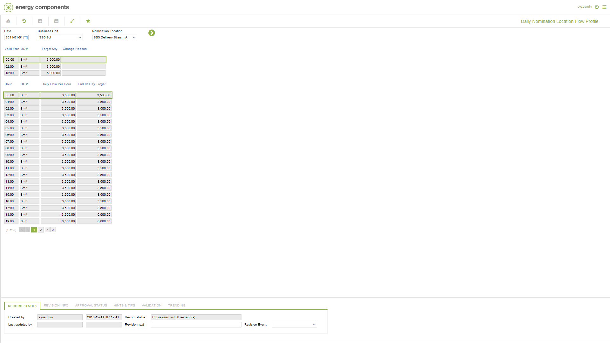

# SD.0054 - Daily Nomination Location Flow Profile

_Deep-dive 2026-07-06 (deterministic runner). Module: SD._

## Identity
- BF_CODE: SD.0054 - URL: `/com.ec.sale.sd.screens/daily_nomloc_profile/NAV_MODEL/SALE_COMMERCIAL/TARGET/NOMINATION_LOCATION/BF_PROFILE/SD.0054/CLASS/SLNL_DAY_TARGET/SUB_CLASS/SLNP_SUB_DAY_PROFILE`

## DB binding (metadata-resolved)
| Class | Type/Scope | Base table | View |
|---|---|---|---|
| `SLNP_SUB_DAY_PROFILE` | DATA/1HR | `OBJLOC_SUB_DAY_TARGET` | `DV_SLNP_SUB_DAY_PROFILE` |

_Resolved by: url path token_

## Screen type
DATA/1HR

## Help (screen screenshot -- local online-help corpus 14.2.5)

## Help (field-description images -- local online-help corpus 14.2.5)
_(no field-description images in corpus for this BF_CODE)_
