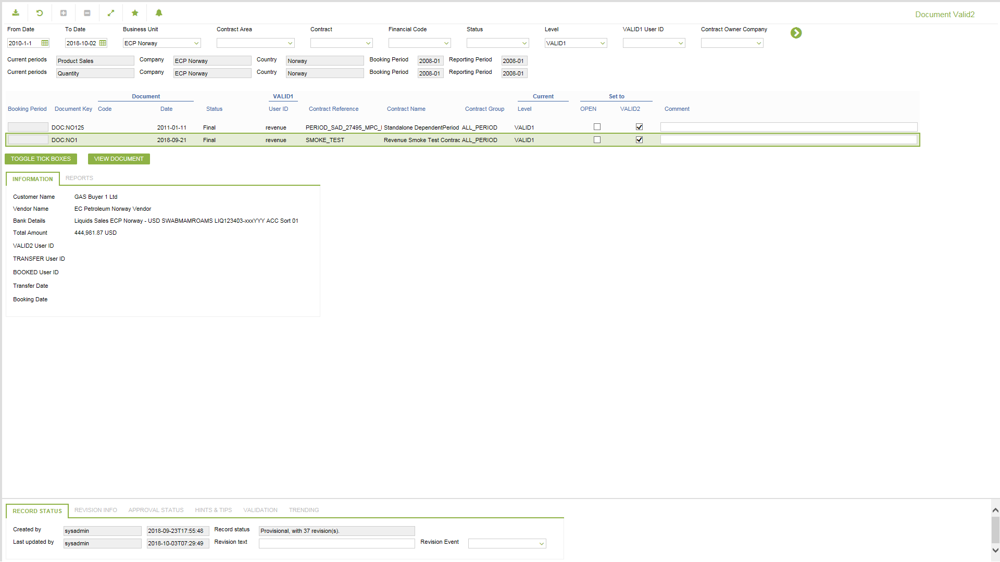
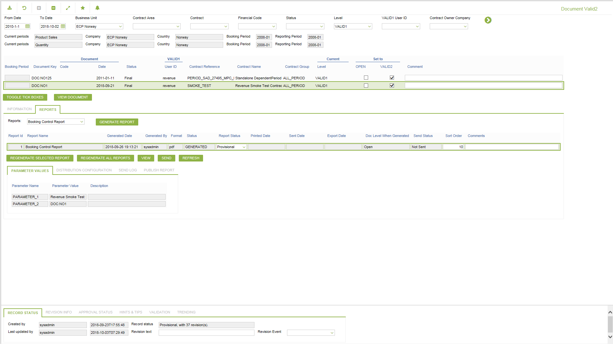

# SP.0003 - Document Valid2

_Deep-dive 2026-07-06 (deterministic runner). Module: SP._

## Identity
- BF_CODE: SP.0003 - URL: `/com.ec.revn.sp/document_validation/MODE/VALID2/DLC/VALID1`

## DB binding (metadata-resolved)
| Class | Type/Scope | Base table | View |
|---|---|---|---|
| `CONT_DOCUMENT_VALID2` | DATA/DAY | `CONT_DOCUMENT` | `DV_CONT_DOCUMENT_VALID2` |

_Resolved by: label (exact, unique)_

## Screen type
N1 daily-status grid

## Help (screen screenshot -- local online-help corpus 14.2.5)

## Help (field-description images -- local online-help corpus 14.2.5)
_(no field-description images in corpus for this BF_CODE)_
