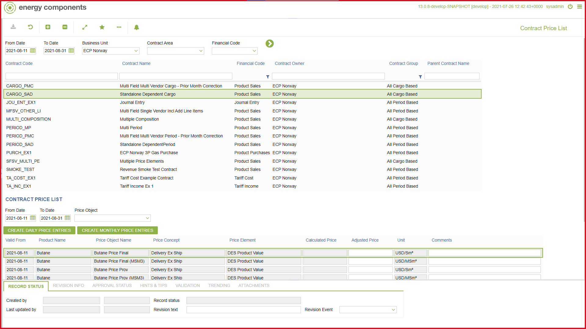

# SP.0011 - Contract Price List

_Deep-dive 2026-07-06 (deterministic runner). Module: SP._

## Identity
- BF_CODE: SP.0011 - URL: `/com.ec.revn.sp/price_values`

## DB binding (metadata-resolved)
| Class | Type/Scope | Base table | View |
|---|---|---|---|
| `CONTRACT_PRICE_LIST` | DATA/EVENT | `PRODUCT_PRICE_VALUE` | `DV_CONTRACT_PRICE_LIST` |

_Resolved by: label (exact, unique)_

## Screen type
DATA/EVENT

## Help (screen screenshot -- local online-help corpus 14.2.5)

## Help (field-description images -- local online-help corpus 14.2.5)
_(no field-description images in corpus for this BF_CODE)_
