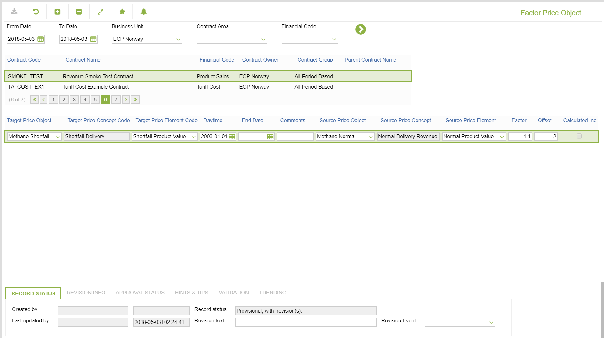

# SP.0036 - Factor Price Object

_Deep-dive 2026-07-06 (deterministic runner). Module: SP._

## Identity
- BF_CODE: SP.0036 - URL: `/com.ec.revn.sp/derived_price_object/CLASS_NAME/PRICE_OBJECT`

## DB binding (metadata-resolved)
| Class | Type/Scope | Base table | View |
|---|---|---|---|
| `PRICE_OBJECT` | OBJECT/VERSIONED | `PRODUCT_PRICE` | `OV_PRICE_OBJECT` |

_Resolved by: url CLASS_NAME_

## Screen type
OV (master-data object)

## Help (screen screenshot -- local online-help corpus 14.2.5)

## Help (field-description images -- local online-help corpus 14.2.5)
_(no field-description images in corpus for this BF_CODE)_
