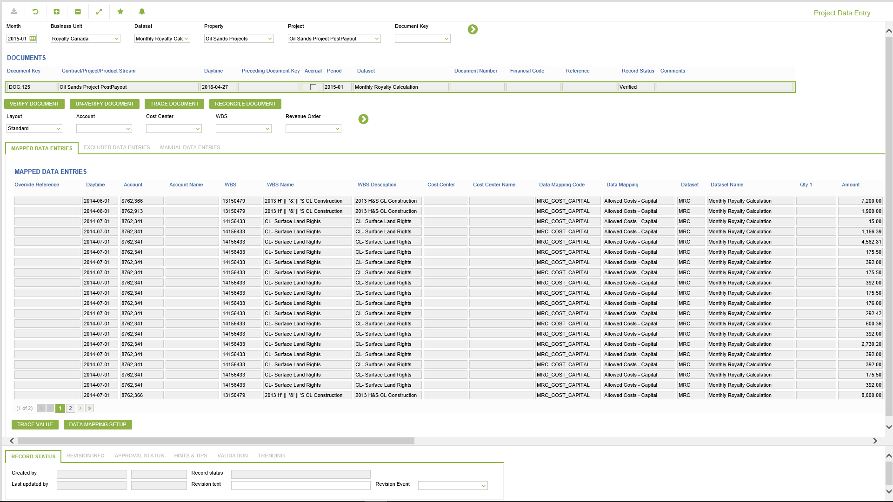
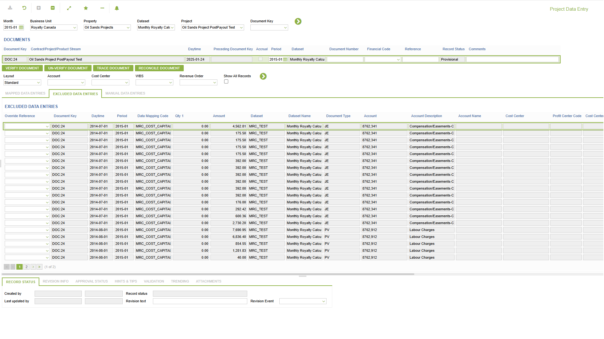
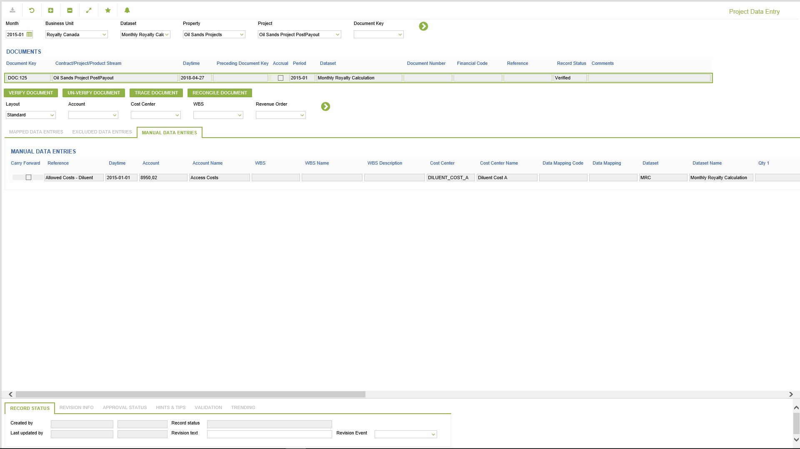
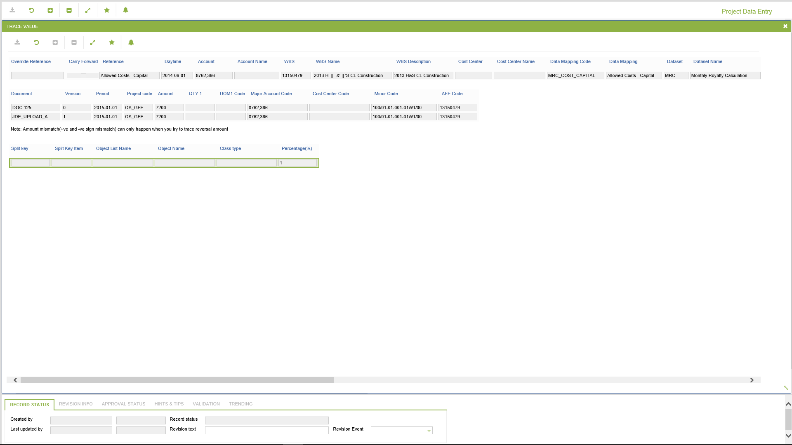
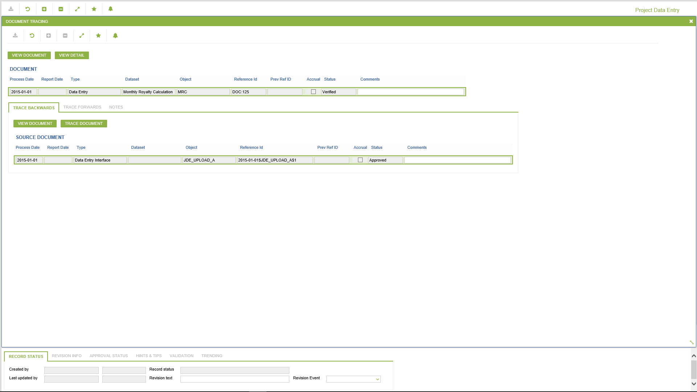
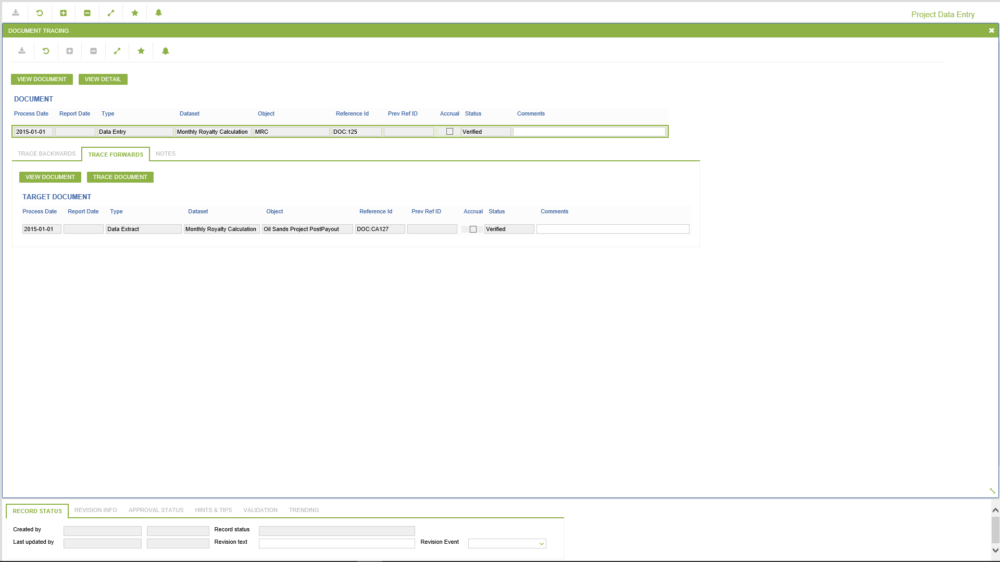
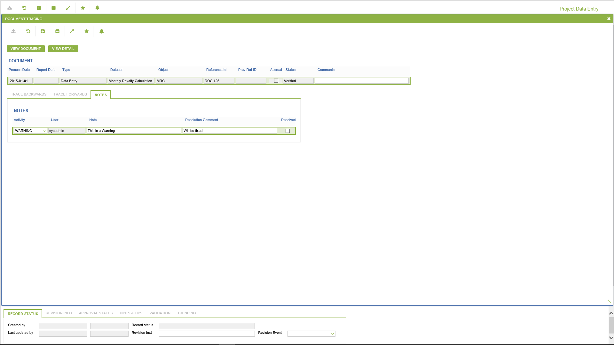
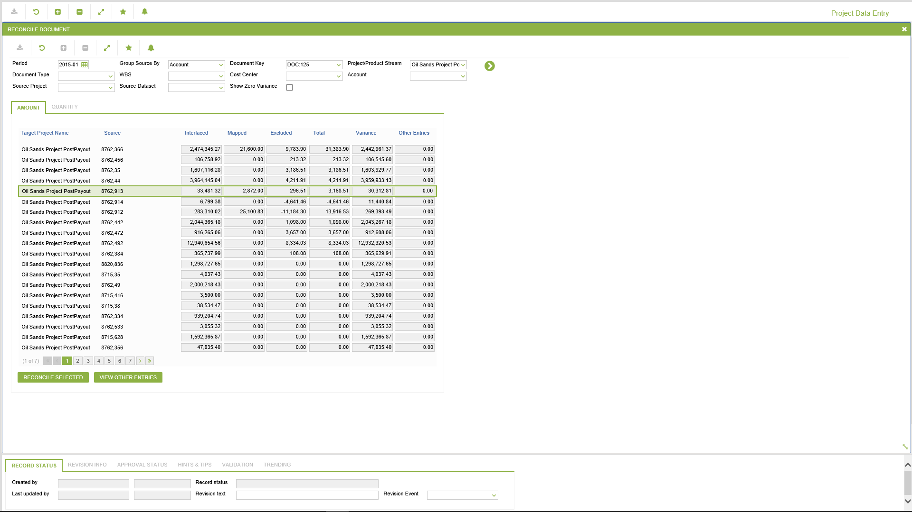
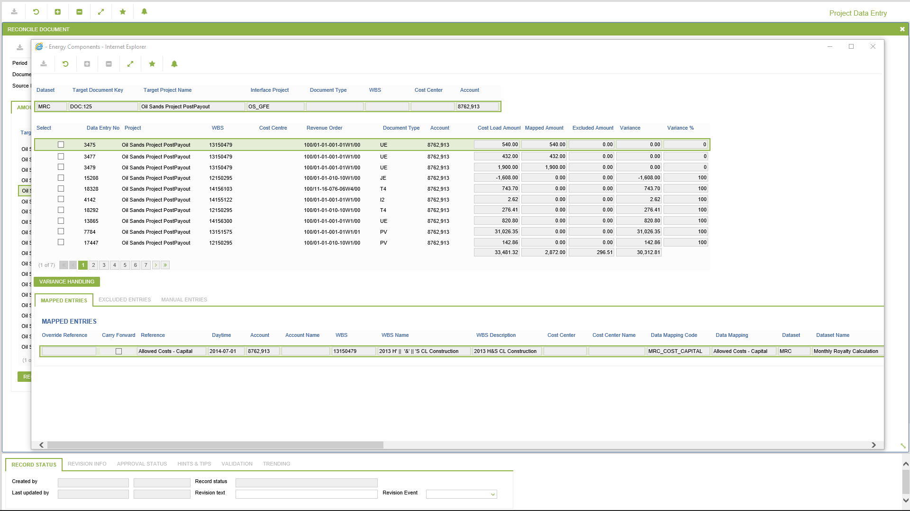
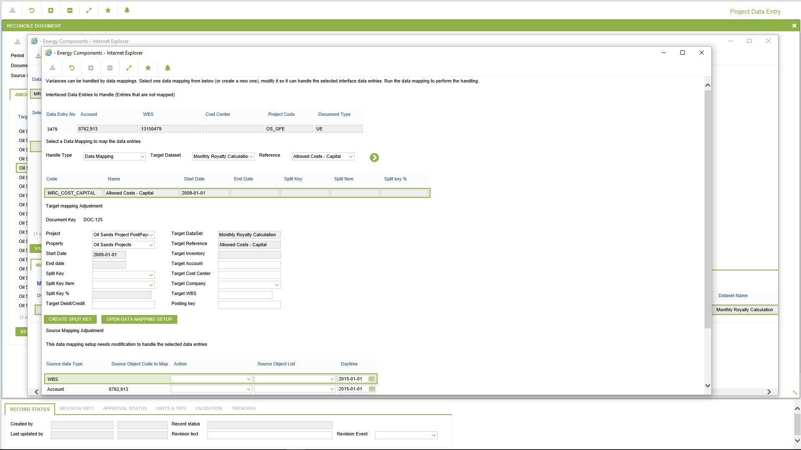

# SP.0042 - Project Data Entry

_Deep-dive 2026-07-06 (deterministic runner). Module: SP._

## Identity
- BF_CODE: SP.0042 - URL: `/com.ec.revn.sp/cont_journal_entry`

## DB binding (metadata-resolved)
| Class | Type/Scope | Base table | View |
|---|---|---|---|
| `CONT_JOURNAL_ENTRY` | TABLE/MTH | `CONT_JOURNAL_ENTRY` | `TV_CONT_JOURNAL_ENTRY` |

_Resolved by: url path token_

## Screen type
TV (table-class)

## Help (screen screenshot -- local online-help corpus 14.2.5)

## Help (field-description images -- local online-help corpus 14.2.5)
_(no field-description images in corpus for this BF_CODE)_
