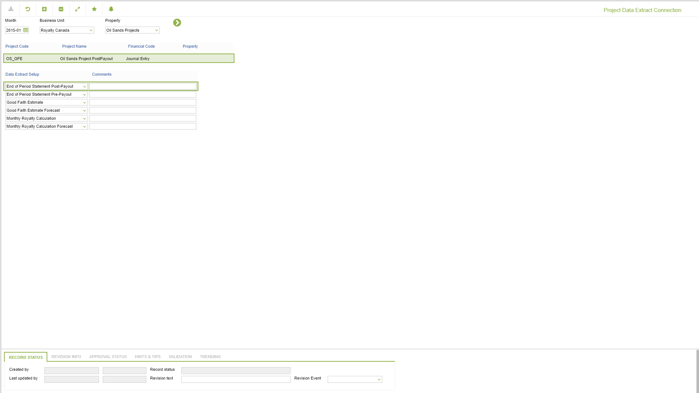
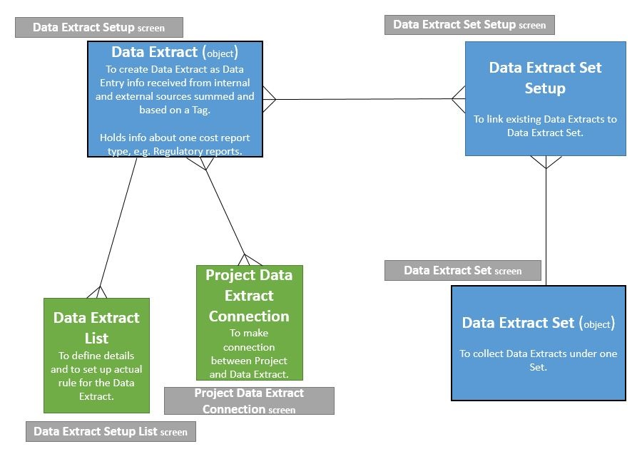

# SP.0044 - Project Data Extract Connection

_Deep-dive 2026-07-06 (deterministic runner). Module: SP._

## Identity
- BF_CODE: SP.0044 - URL: `/com.ec.revn.sp/contract_summary_setup`

## DB binding (metadata-resolved)
| Class | Type/Scope | Base table | View |
|---|---|---|---|
| `CONTRACT_SUMMARY_SETUP` | TABLE/EVENT | `CONTRACT_SUMMARY_SETUP` | `TV_CONTRACT_SUMMARY_SETUP` |

_Resolved by: url path token_

## Screen type
TV (table-class)

## Help (screen screenshot -- local online-help corpus 14.2.5)

## Help (field-description images -- local online-help corpus 14.2.5)

