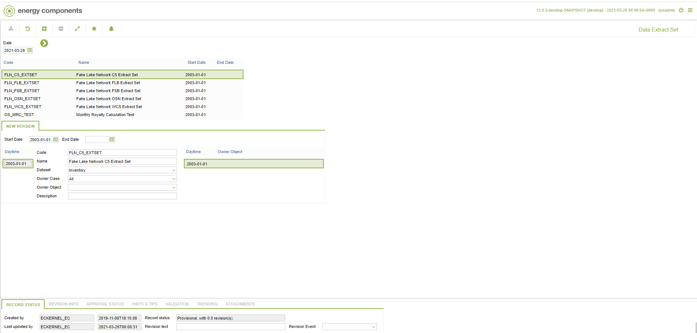

# SP.0049 - Data Extract Set

_Deep-dive 2026-07-06 (deterministic runner). Module: SP._

## Identity
- BF_CODE: SP.0049 - URL: `/com.ec.frmw.co.screens/manage_object_nav/CLASS_NAME/SUMMARY_SET`

## DB binding (metadata-resolved)
| Class | Type/Scope | Base table | View |
|---|---|---|---|
| `SUMMARY_SET` | OBJECT/VERSIONED | `SUMMARY_SET` | `OV_SUMMARY_SET` |

_Resolved by: url CLASS_NAME_

## Screen type
OV (master-data object)

## Help (screen screenshot -- local online-help corpus 14.2.5)

## Help (field-description images -- local online-help corpus 14.2.5)

