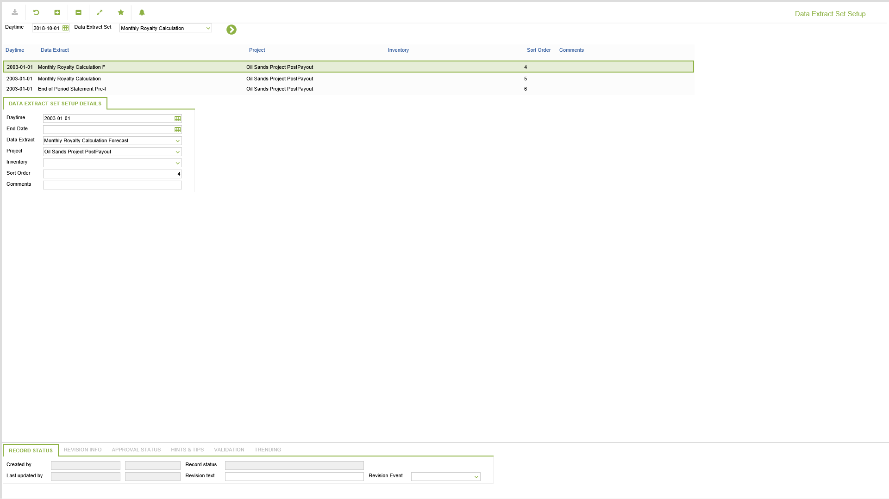

# SP.0050 - Data Extract Set Setup

_Deep-dive 2026-07-06 (deterministic runner). Module: SP._

## Identity
- BF_CODE: SP.0050 - URL: `/com.ec.revn.sp/manage_summary_set_setup`

## DB binding (metadata-resolved)
| Class | Type/Scope | Base table | View |
|---|---|---|---|
| `SUMMARY_SET_SETUP` | DATA/DAY | `SUMMARY_SET_SETUP` | `DV_SUMMARY_SET_SETUP` |

_Resolved by: url path token_

## Screen type
N1 daily-status grid

## Help (screen screenshot -- local online-help corpus 14.2.5)

## Help (field-description images -- local online-help corpus 14.2.5)

