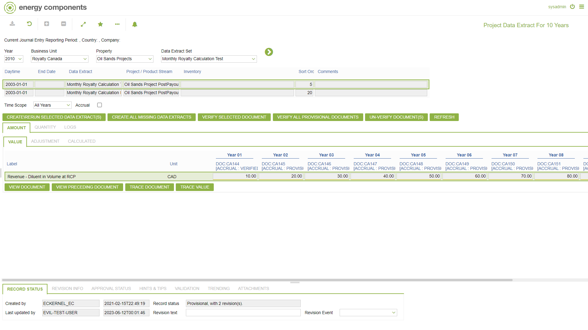
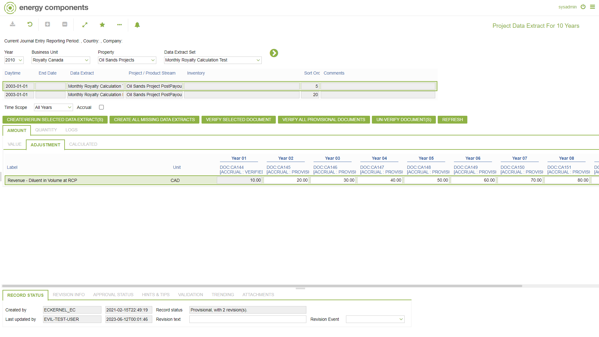
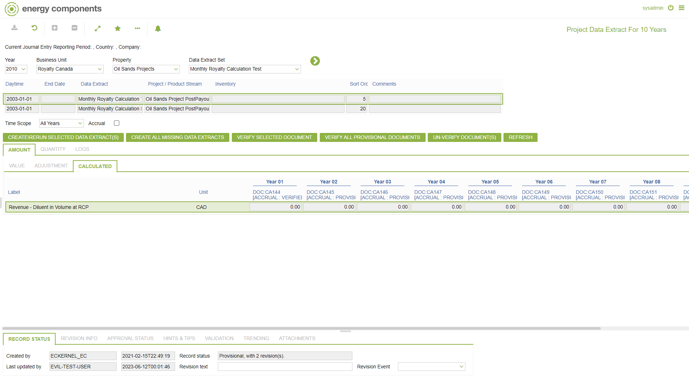
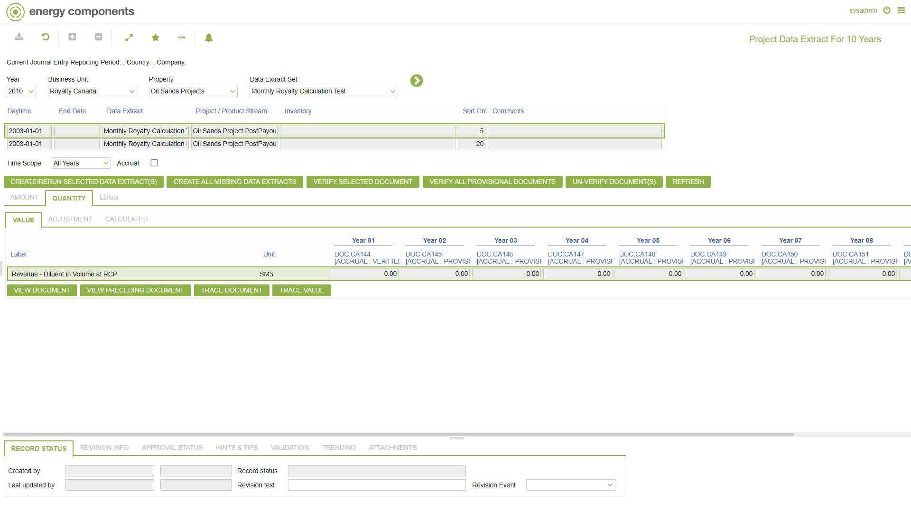
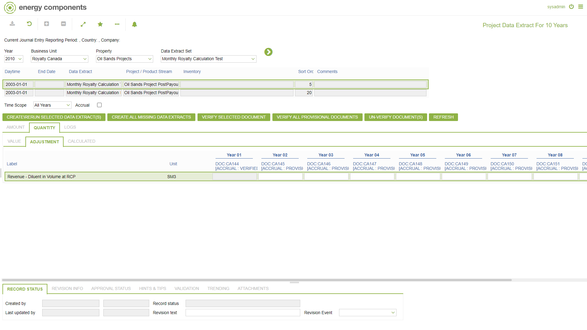
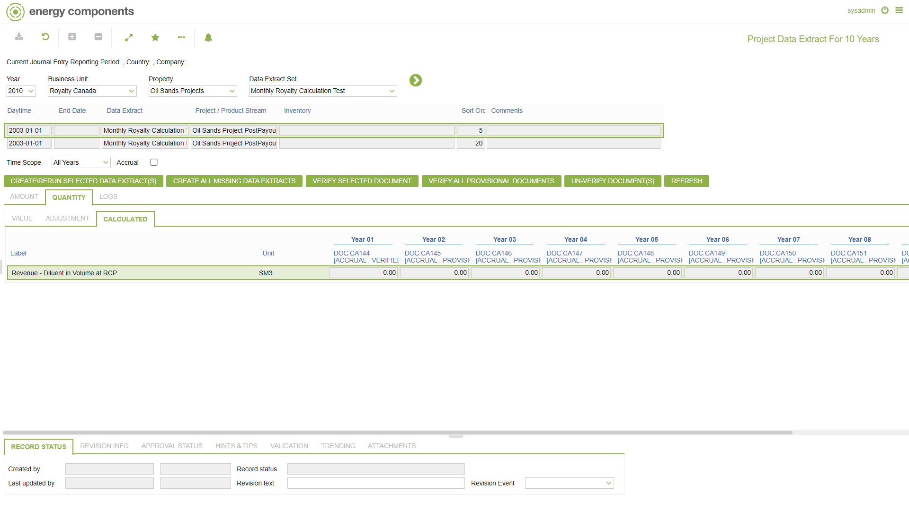
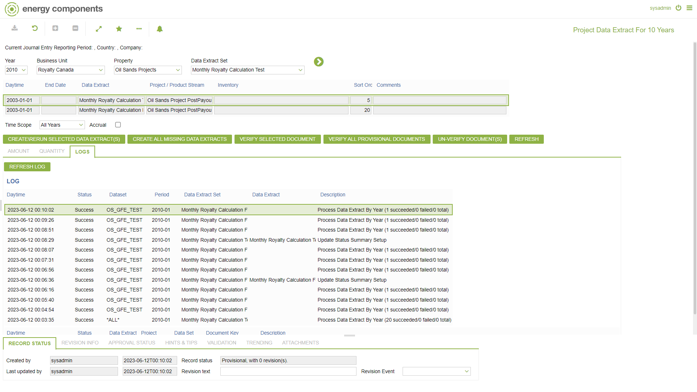

# SP.0072 - Project Data Extract For 10 Years

_Deep-dive 2026-07-06 (deterministic runner). Module: SP._

## Identity
- BF_CODE: SP.0072 - URL: `/com.ec.revn.sp/cont_summary_year/CLASS_NAME/SUMMARY_DECADE`

## DB binding (metadata-resolved)
| Class | Type/Scope | Base table | View |
|---|---|---|---|
| `SUMMARY_DECADE` | TABLE/YR | `V_SUMMARY_DECADE` | `TV_SUMMARY_DECADE` |

_Resolved by: url CLASS_NAME_

## Screen type
TV (table-class)

## Help (screen screenshot -- local online-help corpus 14.2.5)

## Help (field-description images -- local online-help corpus 14.2.5)
_(no field-description images in corpus for this BF_CODE)_
