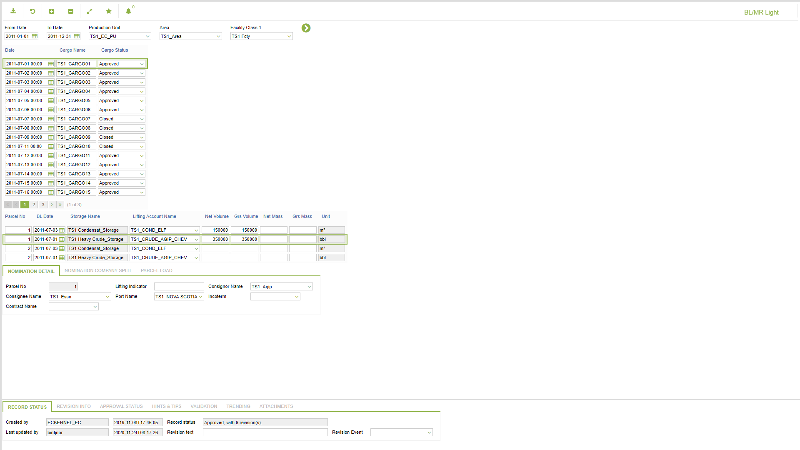
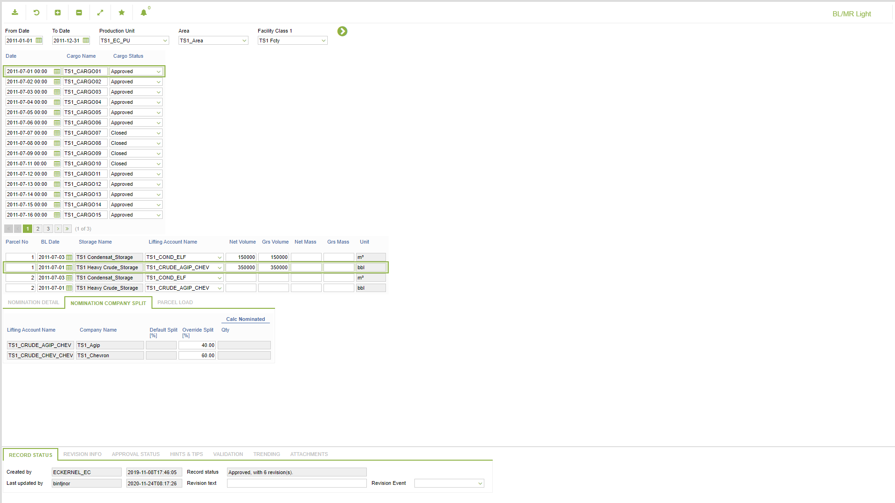
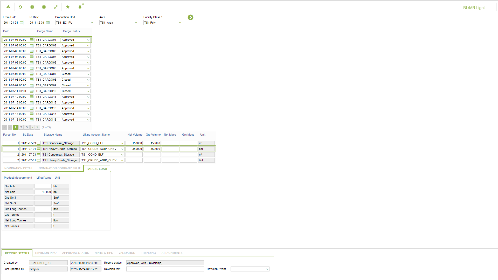

# TO.0017 - BL/MR Light

_Deep-dive 2026-07-06 (deterministic runner). Module: TO._

## Identity
- BF_CODE: TO.0017 - URL: `/com.ec.tran.to.screens/blmr_light/CLASS/CARGO_INFO_LIGHT/SUB_CLASS/STOR_LIFT_NOM_LIGHT/TAB2_NOM_DETAILS/STORAGE_LIFT_NOM_DETAIL/TAB4_ACCOUNT_SPLIT/STOR_LIFT_NOM_CPY_SPLIT/TAB6_ACTUAL_LIFTED/STORAGE_LIFTING`

## DB binding (metadata-resolved)
| Class | Type/Scope | Base table | View |
|---|---|---|---|
| `STORAGE_LIFTING` | TABLE/EVENT | `STORAGE_LIFTING` | `TV_STORAGE_LIFTING` |

_Resolved by: url path token_

## Screen type
TV (table-class)

## Help (screen screenshot -- local online-help corpus 14.2.5)

## Help (field-description images -- local online-help corpus 14.2.5)
_(no field-description images in corpus for this BF_CODE)_
