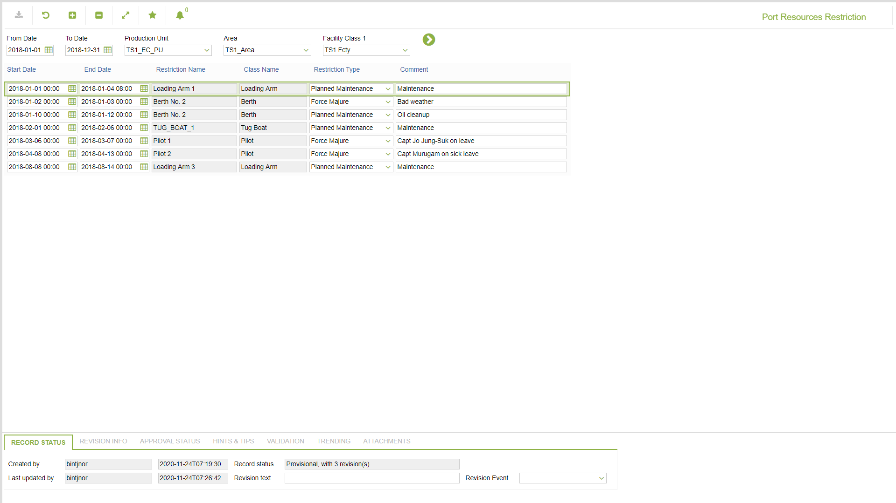

# TO.0034 - Port Resources Restriction

_Deep-dive 2026-07-06 (deterministic runner). Module: TO._

## Identity
- BF_CODE: TO.0034 - URL: `/com.ec.tran.to.screens/port_resources_restriction`

## DB binding (metadata-resolved)
| Class | Type/Scope | Base table | View |
|---|---|---|---|
| `PORT_RES_RESTRICTION` | DATA/EVENT | `PORT_RES_RESTRICTION` | `DV_PORT_RES_RESTRICTION` |

_Resolved by: label (exact, unique)_

## Screen type
DATA/EVENT

## Help (screen screenshot -- local online-help corpus 14.2.5)

## Help (field-description images -- local online-help corpus 14.2.5)
_(no field-description images in corpus for this BF_CODE)_
