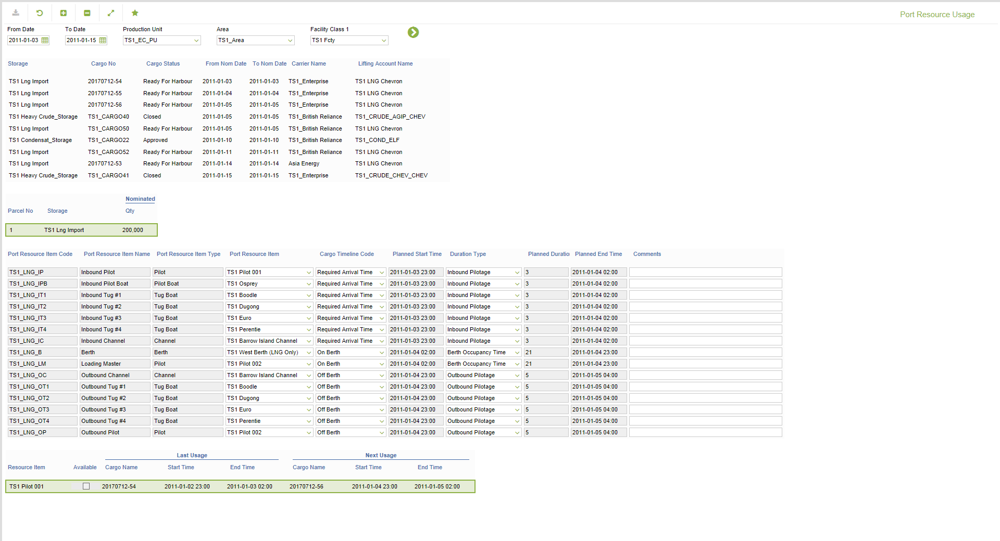

# TO.0035 - Port Resource Usage

_Deep-dive 2026-07-06 (deterministic runner). Module: TO._

## Identity
- BF_CODE: TO.0035 - URL: `/com.ec.tran.to.screens/port_resource_usage/CARGO_NAV_CLASS/TERM_OPERATION_NAVIGATOR`

## DB binding (metadata-resolved)
| Class | Type/Scope | Base table | View |
|---|---|---|---|
| `TERM_OPERATION_NAVIGATOR` | TABLE/EVENT | `CARGO_TRANSPORT` | `TV_TERM_OPERATION_NAVIGATOR` |

_Resolved by: url path token_

## Screen type
TV (table-class)

## Help (screen screenshot -- local online-help corpus 14.2.5)

## Help (field-description images -- local online-help corpus 14.2.5)
_(no field-description images in corpus for this BF_CODE)_
