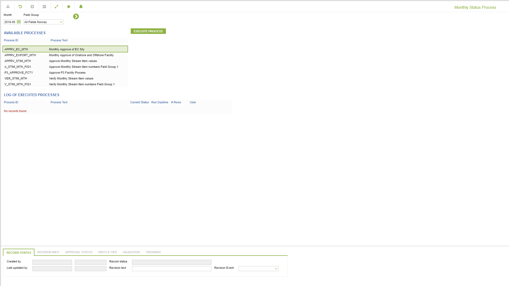

# VO.0027 - Monthly Status Process

_Deep-dive 2026-07-06 (deterministic runner). Module: VO._

## Identity
- BF_CODE: VO.0027 - URL: `/com.ec.revn.vo/monthly_data_status_process`

## DB binding (metadata-resolved)
| Class | Type/Scope | Base table | View |
|---|---|---|---|
| `MONTHLY_STATUS_PROCESS` | TABLE/EVENT | `STAT_PROCESS_STATUS` | `TV_MONTHLY_STATUS_PROCESS` |

_Resolved by: label (exact, unique)_

## Screen type
TV (table-class)

## Help (screen screenshot -- local online-help corpus 14.2.5)

## Help (field-description images -- local online-help corpus 14.2.5)
_(no field-description images in corpus for this BF_CODE)_
