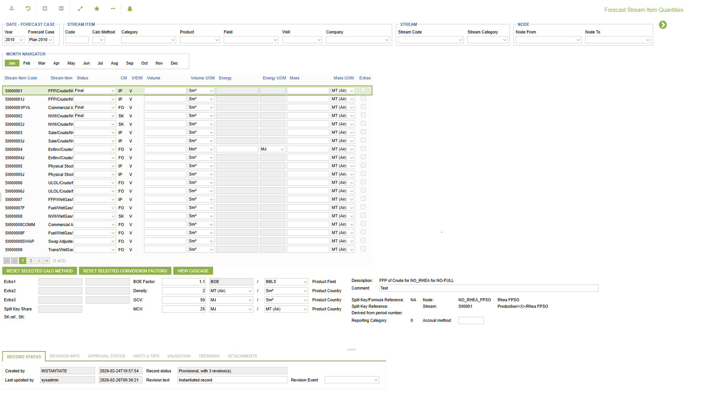

# VO.0041 - Forecast Stream Item Quantities

_Deep-dive 2026-07-06 (deterministic runner). Module: VO._

## Identity
- BF_CODE: VO.0041 - URL: `/com.ec.revn.vo/fcst_stim_mth_query_quantities/type/forecast`

## DB binding (metadata-resolved)
| Class | Type/Scope | Base table | View |
|---|---|---|---|
| `FORECAST` | OBJECT/VERSIONED | `FORECAST` | `OV_FORECAST` |

_Resolved by: url path token_

## Screen type
OV (master-data object)

## Help (screen screenshot -- local online-help corpus 14.2.5)

## Help (field-description images -- local online-help corpus 14.2.5)
_(no field-description images in corpus for this BF_CODE)_
