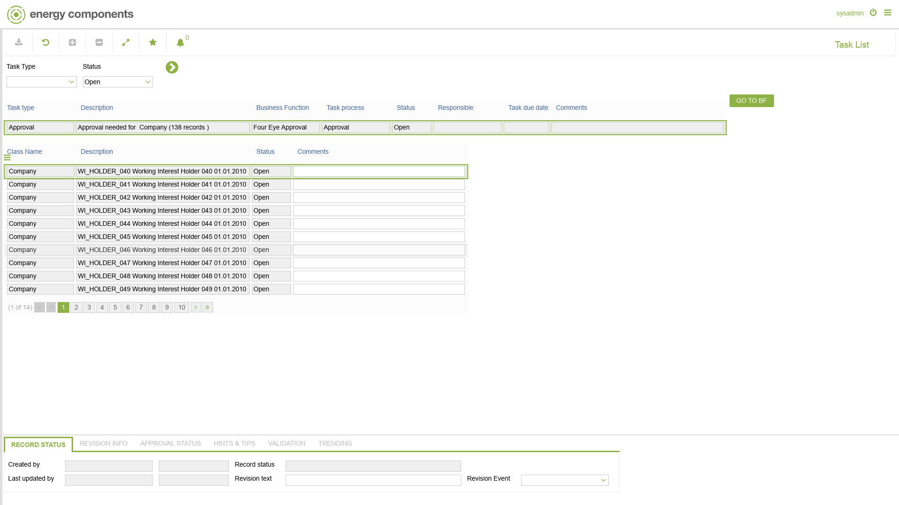

# WL.0001 - Task List

_Deep-dive 2026-07-07 (deterministic runner). Module: WL._

## Identity
- BF_CODE: WL.0001 - URL: `/com.ec.frmw.workflow.screens/task_list`

## DB binding (metadata-resolved)
| Class | Type/Scope | Base table | View |
|---|---|---|---|
| `TASK_LIST` | TABLE/NONE | `V_TASK_LIST` | `TV_TASK_LIST` |

_Resolved by: url path token_

## Screen type
TV (table-class)

## Help (screen screenshot -- local online-help corpus 14.2.5)

## Help (field-description images -- local online-help corpus 14.2.5)
_(no field-description images in corpus for this BF_CODE)_
