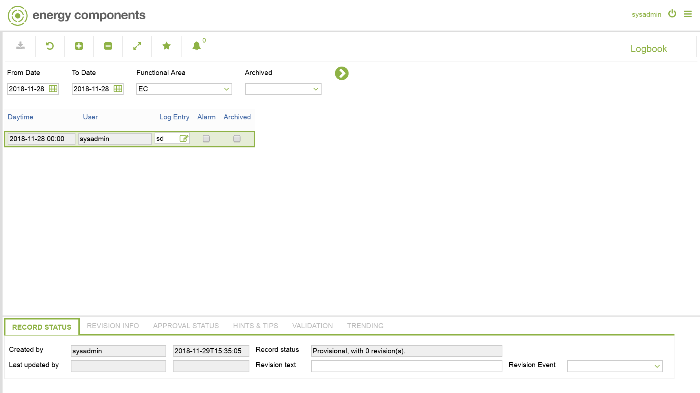

# WL.0003 - Logbook

_Deep-dive 2026-07-07 (deterministic runner). Module: WL._

## Identity
- BF_CODE: WL.0003 - URL: `/com.ec.frmw.workflow.screens/logbook`

## DB binding (metadata-resolved)
| Class | Type/Scope | Base table | View |
|---|---|---|---|
| `LOG_ENTRY` | DATA/DAY | `LOG_ENTRY` | `DV_LOG_ENTRY` |

_Resolved by: label (exact, unique)_

## Screen type
N1 daily-status grid

## Help (screen screenshot -- local online-help corpus 14.2.5)

## Help (field-description images -- local online-help corpus 14.2.5)
_(no field-description images in corpus for this BF_CODE)_
