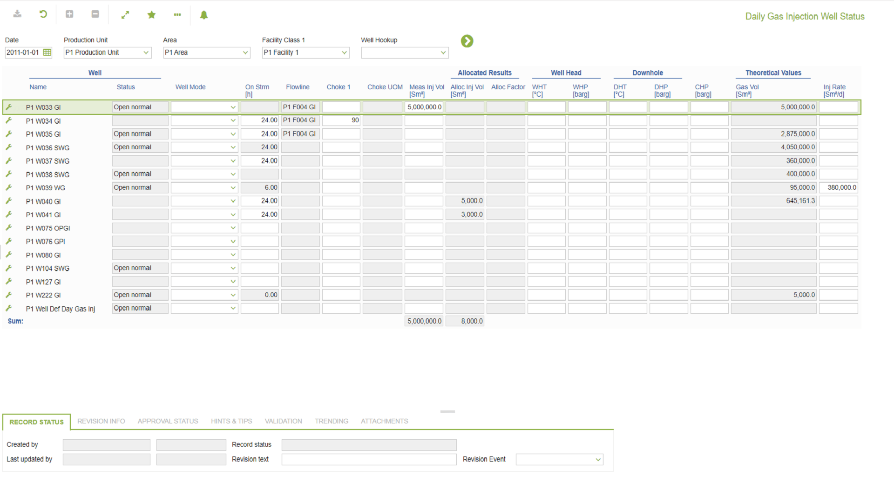

# WR.0002 - Daily Gas Injection Well Status

_Deep-dive 2026-07-05 (deterministic runner). Module: WR._

## Identity
- BF_CODE: WR.0002 - URL: `/com.ec.prod.wr.screens/daily_well_status/GROUPMODEL/WELL/TARGET/WELL/CLASS_NAME/IWEL_DAY_STATUS_GAS`

## DB binding (metadata-resolved)
| Class | Type/Scope | Base table | View |
|---|---|---|---|
| `IWEL_DAY_STATUS_GAS` | DATA/DAY | `IWEL_DAY_STATUS` | `DV_IWEL_DAY_STATUS_GAS` |

_Resolved by: url CLASS_NAME_

## Screen type
N1 daily-status grid

## Help (screen screenshot -- local online-help corpus 14.2.5)

## Help (field-description images -- local online-help corpus 14.2.5)
_(no field-description images in corpus for this BF_CODE)_
