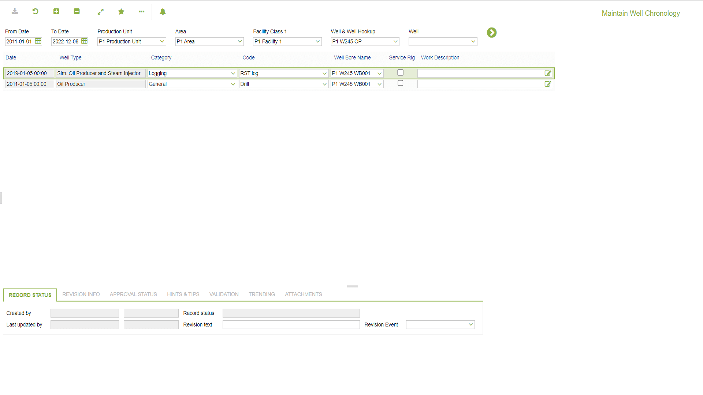

# WR.0011 - Maintain Well Chronology

_Deep-dive 2026-07-05 (deterministic runner). Module: WR._

## Identity
- BF_CODE: WR.0011 - URL: `/com.ec.prod.wr.screens/maintain_well_chronology`

## DB binding (metadata-resolved)
| Class | Type/Scope | Base table | View |
|---|---|---|---|
| `WELL_CHRONOLOGY` | DATA/EVENT | `WELL_CHRONOLOGY` | `DV_WELL_CHRONOLOGY` |

_Resolved by: url path token_

## Screen type
DATA/EVENT

## Help (screen screenshot -- local online-help corpus 14.2.5)

## Help (field-description images -- local online-help corpus 14.2.5)
_(no field-description images in corpus for this BF_CODE)_
