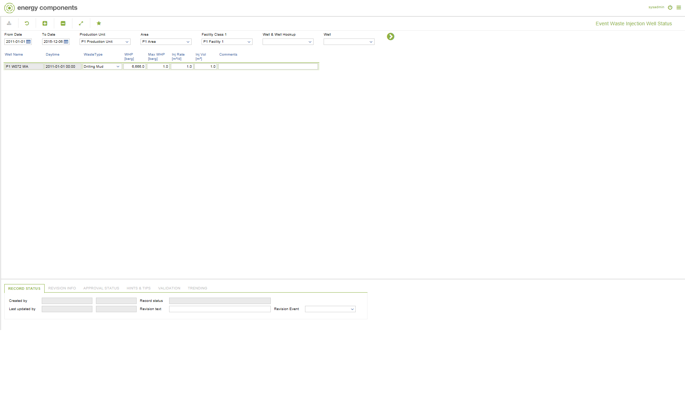

# WR.0040 - Event Waste Injection Well Status

_Deep-dive 2026-07-06 (deterministic runner). Module: WR._

## Identity
- BF_CODE: WR.0040 - URL: `/com.ec.prod.wr.screens/event_waste_injection_well_status`

## DB binding (metadata-resolved)
| Class | Type/Scope | Base table | View |
|---|---|---|---|
| `WELL_WASTE_INJ` | DATA/EVENT | `WELL_EVENT` | `DV_WELL_WASTE_INJ` |

_Resolved by: label (exact, unique)_

## Screen type
DATA/EVENT

## Help (screen screenshot -- local online-help corpus 14.2.5)

## Help (field-description images -- local online-help corpus 14.2.5)
_(no field-description images in corpus for this BF_CODE)_
