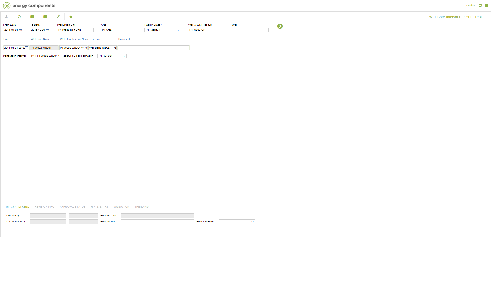

# WR.0059 - Well Bore Interval Pressure Test

_Deep-dive 2026-07-06 (deterministic runner). Module: WR._

## Identity
- BF_CODE: WR.0059 - URL: `/com.ec.prod.wr.screens/webo_interval_pressure_test`

## DB binding (metadata-resolved)
| Class | Type/Scope | Base table | View |
|---|---|---|---|
| `WEBO_INT_PRESSURE_TEST` | DATA/DAY | `WEBO_INT_PRESSURE_TEST` | `DV_WEBO_INT_PRESSURE_TEST` |

_Resolved by: label (exact, unique)_

## Screen type
N1 daily-status grid

## Help (screen screenshot -- local online-help corpus 14.2.5)

## Help (field-description images -- local online-help corpus 14.2.5)
_(no field-description images in corpus for this BF_CODE)_
