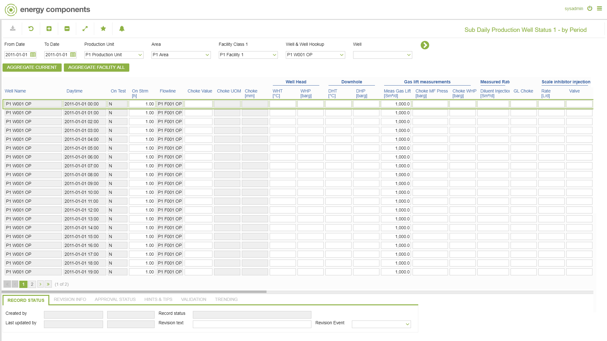
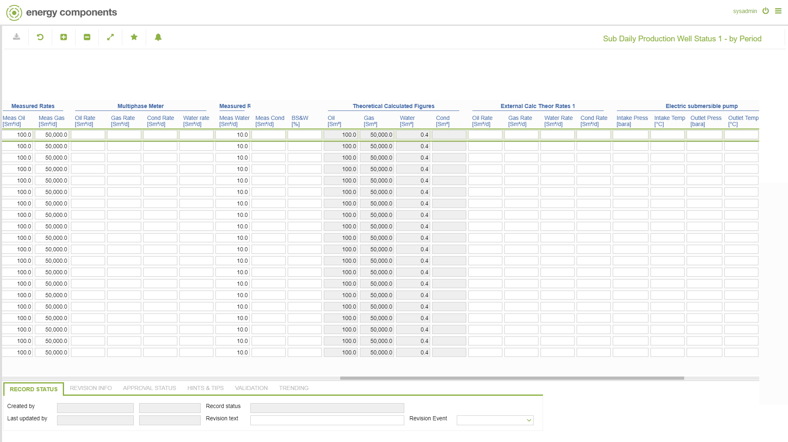
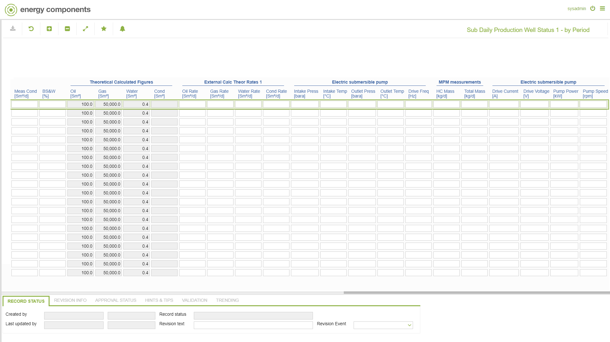

# WR.0064 - Sub Daily Production Well Status 1 - by Period

_Deep-dive 2026-07-06 (deterministic runner). Module: WR._

## Identity
- BF_CODE: WR.0064 - URL: `/com.ec.prod.wr.screens/sub_daily_oil_production_well_status_by_period/CLASS_NAME/PWEL_SUB_DAY_STATUS/DAILY_CLASS_NAME/PWEL_DAY_STATUS`

## DB binding (metadata-resolved)
| Class | Type/Scope | Base table | View |
|---|---|---|---|
| `PWEL_SUB_DAY_STATUS` | DATA/1HR | `PWEL_SUB_DAY_STATUS` | `DV_PWEL_SUB_DAY_STATUS` |
| `PWEL_DAY_STATUS` | DATA/DAY | `PWEL_DAY_STATUS` | `DV_PWEL_DAY_STATUS` |

_Resolved by: url CLASS_NAME_

## Screen type
DATA/1HR

## Help (screen screenshot -- local online-help corpus 14.2.5)

## Help (field-description images -- local online-help corpus 14.2.5)
_(no field-description images in corpus for this BF_CODE)_
