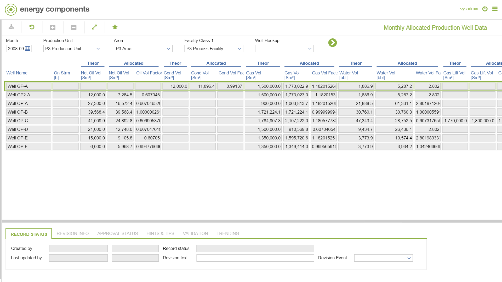
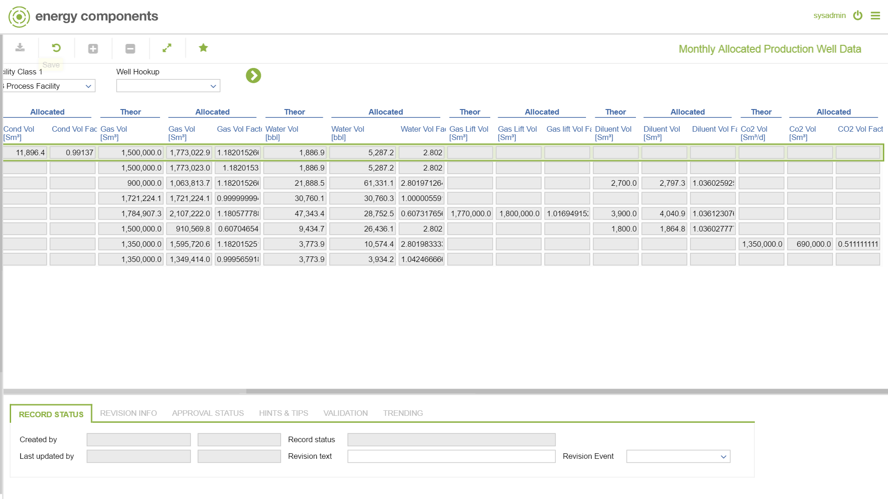

# WR.0078 - Monthly Allocated Production Well Data

_Deep-dive 2026-07-06 (deterministic runner). Module: WR._

## Identity
- BF_CODE: WR.0078 - URL: `/com.ec.prod.wr.screens/monthly_alloc_well_data/CLASS_NAME/PWEL_MTH_ALLOC`

## DB binding (metadata-resolved)
| Class | Type/Scope | Base table | View |
|---|---|---|---|
| `PWEL_MTH_ALLOC` | DATA/MTH | `PWEL_MTH_ALLOC` | `DV_PWEL_MTH_ALLOC` |

_Resolved by: url CLASS_NAME_

## Screen type
DATA/MTH

## Help (screen screenshot -- local online-help corpus 14.2.5)

## Help (field-description images -- local online-help corpus 14.2.5)
_(no field-description images in corpus for this BF_CODE)_
